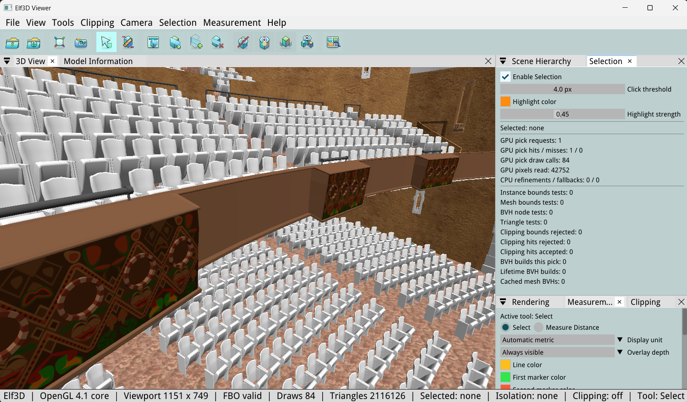
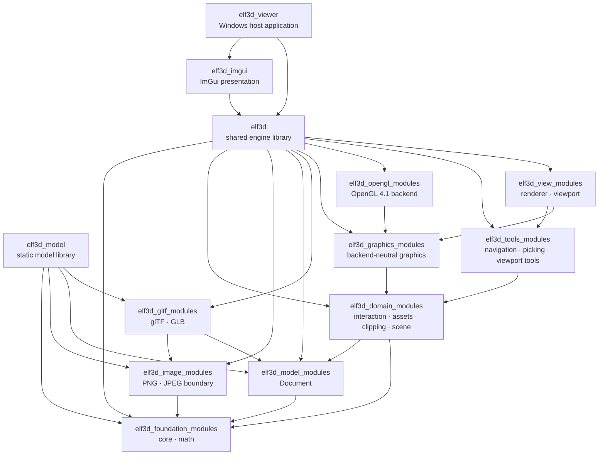

<div align="center">

# Elf3D

**A focused C++20 3D visualization engine and Windows viewer for glTF 2.0.**

[](https://github.com/zavelski/elf3d/actions/workflows/ci.yml)
[](https://github.com/zavelski/elf3d/releases/latest)
[](LICENSE)


[Download the viewer](https://github.com/zavelski/elf3d/releases/latest)
· [Viewer guide](docs/GUIDE.md)
· [C++ API](docs/PUBLIC_API.md)
· [glTF compatibility](docs/GLTF.md)

</div>



<div align="center">
<sub>
Scene: <a href="https://sketchfab.com/3d-models/madame-walker-theatre-98ba4154bbb644bb9cb4d9c68d7dd87b">Madame Walker Theatre</a>
by <a href="https://sketchfab.com/iupuiul">IUPUI University Library</a>,
licensed under <a href="https://creativecommons.org/licenses/by/4.0/">CC BY 4.0</a>.
</sub>
</div>

## What is Elf3D?

Elf3D is both a ready-to-run model inspector and an embeddable rendering stack.
Open a `.gltf` or `.glb`, explore its hierarchy and materials, select or hide
objects, measure surfaces, and cut through geometry with section planes and
clipping boxes.

The project is deliberately focused. It is a static-scene visualization engine,
not a game engine or a general-purpose content editor. The host application
keeps ownership of the native window, event loop, OpenGL context, input, and
final presentation; Elf3D owns scene inspection, rendering, and viewport tools.

## Highlights

- **Model-first workflow** — load and save `.gltf`/`.glb`, retain every scene,
  inspect canonical `elf3d::Document` data, validate references, replace
  primitives, and preserve safe source image and JSON metadata.
- **Interactive inspection** — hierarchy browsing, orbit/pan/dolly navigation,
  GPU-assisted picking, selection, visibility, isolation, visible bounds, and
  model statistics.
- **Analysis tools** — point-to-point surface measurement, one section plane,
  up to three clipping boxes, and backend-neutral helper overlays.
- **OpenGL 4.1 rendering** — metallic/roughness material values, base-color,
  emissive and occlusion textures, vertex color, unlit materials, alpha mask
  and blend paths, and off-screen viewport output.
- **Embeddable by design** — public C++ API with explicit ownership, structured
  `Result<T>` failures, host-controlled lifetime, and no GLFW, Dear ImGui,
  OpenGL, GLM, or cgltf types in the engine API.
- **Bounded input handling** — structured compatibility diagnostics and
  reviewed limits for files, buffers, images, hierarchy depth, and geometry.

## Choose your entry point

| Target | Use it when you need |
| --- | --- |
| `elf3d_viewer` | A Windows desktop application for opening, inspecting, and exporting models. |
| `elf3d` / `elf3d::elf3d` | The full shared engine library: Scene, Viewport, rendering, picking, navigation, and tools. |
| `elf3d_model` / `elf3d::model` | A static CPU-only `Document` library for construction, validation, processing, and glTF/GLB import/export. |
| `elf3d_imgui` / `elf3d::imgui` | Optional presentation of an Elf3D viewport texture through Dear ImGui. |

## Download the viewer

Download the current
[Elf3D 0.8.6 Windows x64 package](https://github.com/zavelski/elf3d/releases/tag/v0.8.6),
extract it, and run `elf3d_viewer.exe`.

Requirements:

- Windows x64;
- an OpenGL 4.1-capable graphics driver;
- Microsoft Visual C++ Redistributable for Visual Studio 2022.

Open a model from **File > Open...**, pass its path as the first command-line
argument, or drop it onto the viewer. Use **File > Save As...** to export the
retained model as `.gltf` or `.glb`.

## Build from source

Install Visual Studio 2022 with the Desktop development with C++ workload and
CMake 3.28 or newer. From the repository root:

```powershell
cmake --preset windows-debug
cmake --build --preset windows-debug --parallel
ctest --preset windows-debug --output-on-failure
```

Run the viewer:

```powershell
.\out\build\windows-debug\bin\Debug\elf3d_viewer.exe
```

For the model-only static library and tests:

```powershell
cmake --preset windows-model-debug
cmake --build --preset windows-model-debug --parallel
ctest --preset windows-model-debug --output-on-failure
```

Release configurations, output paths, and troubleshooting are documented in
[Building Elf3D](docs/BUILDING.md).

## Architecture

Elf3D uses 19 restricted C++20 named modules as its primary architecture.
Nine internal CMake `OBJECT` targets group those modules for practical build
and IDE scale; the groups do not replace the module boundaries.



The dependency direction is intentionally one-way:

- engine and domain modules do not depend on Dear ImGui, GLFW, or application
  GUI code;
- Scene remains independent of Renderer and concrete graphics backends;
- native OpenGL and third-party types stay inside named boundary adapters;
- `elf3d_model` configures without Scene, Renderer, OpenGL, ImGui, GLFW, or the
  viewer.

See the [C++ API guide](docs/PUBLIC_API.md) for ownership and shutdown rules.

## Current scope

Elf3D concentrates on static glTF inspection. The supported path includes all
scenes, perspective cameras, indexed and non-indexed triangle geometry,
triangle strip/fan conversion, two UV sets, vertex color, core PBR values,
selected material extensions, PNG/JPEG images, hierarchy, transforms, model
diagnostics, and transactional export.

Animation playback, skinning, morph deformation, orthographic rendering, scene
lights, shadows, image-based lighting, tangent-space normal mapping, compressed
geometry, KTX2/BasisU/WebP, and order-independent transparency are outside the
current rendering scope. Windows x64 is the validated platform; other
platforms remain portability targets.

The detailed support matrix is in [glTF compatibility](docs/GLTF.md), and the
graphics behavior is in [Rendering reference](docs/RENDERING.md).

## Repository map

| Path | Responsibility |
| --- | --- |
| `include/elf3d/` | Public C++ headers |
| `facade/elf3d/` | Shared-library entry points and public/internal conversion |
| `modules/` | Named modules, implementations, and focused tests |
| `integrations/imgui/` | Optional Dear ImGui presentation integration |
| `apps/viewer/` | Desktop host application and runtime assets |
| `tests/` | Public API and real OpenGL integration tests |
| `cmake/` | Target-scoped build configuration |
| `third_party/` | Pinned vendored dependencies and license notices |
| `docs/` | Viewer, API, format, rendering, build, and testing documentation |

## Documentation

- [Practical viewer guide](docs/GUIDE.md)
- [Viewer controls and reference](docs/VIEWER.md)
- [C++ API guide](docs/PUBLIC_API.md)
- [glTF compatibility](docs/GLTF.md)
- [Rendering reference](docs/RENDERING.md)
- [Building](docs/BUILDING.md)
- [Testing](docs/TESTING.md)
- [Support](SUPPORT.md)

## Contributing

Bug reports and focused contributions are welcome. See
[CONTRIBUTING.md](CONTRIBUTING.md), and do not upload confidential,
customer-owned, or license-restricted models with an issue.

## License

Elf3D source is available under the [MIT License](LICENSE). Vendored
dependencies, runtime assets, and README visuals retain their respective
licenses and notices; see [THIRD_PARTY.md](THIRD_PARTY.md) and the
[README visual attribution](docs/assets/readme/ATTRIBUTION.md).
