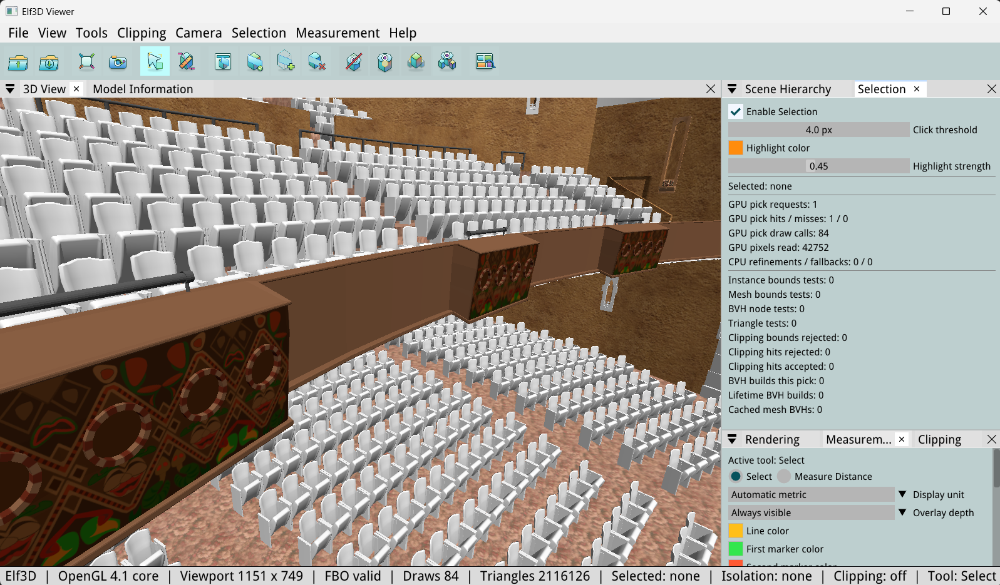
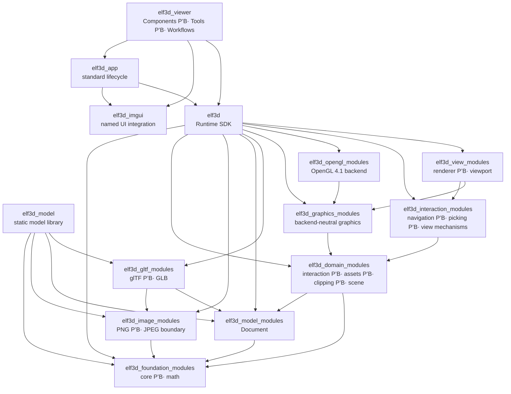

<div align="center">

# Elf3D

**A focused C++20 3D visualization engine and Windows viewer for glTF 2.0.**

[](https://github.com/zavelski/elf3d/actions/workflows/ci.yml)
[](https://github.com/zavelski/elf3d/releases/latest)
[](LICENSE)


[Download the viewer](https://github.com/zavelski/elf3d/releases/latest)
Р’В· [Viewer guide](docs/GUIDE.md)
Р’В· [C++ API](docs/PUBLIC_API.md)
Р’В· [glTF compatibility](docs/GLTF.md)

</div>



<div align="center">
<sub>
Scene: <a href="https://sketchfab.com/3d-models/madame-walker-theatre-98ba4154bbb644bb9cb4d9c68d7dd87b">Madame Walker Theatre</a>
by <a href="https://sketchfab.com/iupuiul">IUPUI University Library</a>,
licensed under <a href="https://creativecommons.org/licenses/by/4.0/">CC BY 4.0</a>.
</sub>
</div>

## What is Elf3D?

Elf3D is a ready-to-run model inspector and a reusable 3D application platform.
Open a `.gltf` or `.glb`, explore its hierarchy and materials, select or hide
objects, measure surfaces, and cut through geometry with section planes and
clipping boxes.

The standard application framework owns the native window, event loop, OpenGL
context, normalized input, frame sequence, final presentation, and teardown.
Applications own composition and concrete Components, Tools, and Workflows.
All graphical applications, including hidden capture and benchmark tools, use
`elf3d_app` and `run_application()`. CPU-only processing uses `elf3d_model`.

## Highlights

- **Model-first workflow** — load and save `.gltf`/`.glb`, retain every scene,
  inspect canonical `elf3d::Document` data, validate references, replace
  primitives, and preserve safe source image and JSON metadata.
- **Interactive inspection** — hierarchy browsing, orbit/pan/dolly navigation,
  GPU-assisted picking, selection, visibility, isolation, visible bounds, and
  model statistics.
- **Analysis tools** — point-to-point surface measurement, one section plane,
  up to three clipping boxes, and backend-neutral helper overlays.
- **OpenGL 4.1 rendering** — metallic/roughness material values, base-color,
  emissive and occlusion textures, vertex color, unlit materials, alpha mask
  and blend paths, and off-screen viewport output.
- **One graphical lifecycle** — `elf3d_app` owns desktop execution for the viewer,
  capture tools, benchmarks, and graphical integration tests. Public RGBA8
  readback supports captures without native graphics handles.
- **Bounded input handling** — structured compatibility diagnostics and
  reviewed limits for files, buffers, images, hierarchy depth, and geometry.

## Choose your entry point

| Target | Use it when you need |
| --- | --- |
| `elf3d_viewer` | A Windows desktop application for opening, inspecting, and exporting models. |
| `elf3d_app` / `elf3d::app` | The canonical desktop lifecycle with normalized input and queued viewport rendering. |
| `elf3d` / `elf3d::elf3d` | The shared Runtime SDK: Scene, Viewport, rendering, picking, navigation, and general mechanisms. |
| `elf3d_model` / `elf3d::model` | A static CPU-only `Document` library for construction, validation, processing, and glTF/GLB import/export. |
| `elf3d_imgui` / `elf3d::imgui` | Named Dear ImGui presentation integration used by the standard desktop framework. |

## Download the viewer

This source version is **0.11.3**. Download a published
[Windows x64 viewer package](https://github.com/zavelski/elf3d/releases/latest),
extract it, and run `elf3d_viewer.exe`.

Requirements:

- Windows x64;
- an OpenGL 4.1-capable graphics driver;
- Microsoft Visual C++ v14 x64 Redistributable, at least as recent as the
  MSVC 19.51 build tools used for this release. The IDE is not required to run it.

Open a model from **File > Open...**, pass its path as the first command-line
argument, or drop it onto the viewer. Use **File > Save As...** to export the
retained model as `.gltf` or `.glb`.

## Build from source

Install Visual Studio 2026 or newer with Desktop development with C++ (native
MSVC 19.50 or newer), standalone CMake 4.4.3, and PowerShell 7.6.5 or newer.
The current presets select v145/x64 and generate `.slnx` solutions. Recreate
existing build directories when upgrading the toolchain. From the repository root:

```powershell
.\cmake\configure-win.ps1
```

Open and build `win/dependencies/Elf3D-Dependencies.slnx`,
`win/engine/Elf3D-Engine.slnx`, `win/imgui/Elf3D-ImGui.slnx`, and
`win/viewer/Elf3D-Viewer.slnx` in that order. Each solution contains both
Debug and Release; select the same configuration in all four. They contain
production projects only. In the Viewer solution, press F5 to launch.

The executable is `win/viewer/bin/<Configuration>/elf3d_viewer.exe`, with its
matching DLL, assets, and Debug symbols. Downstream Rebuild/Clean leaves upstream
components alone; rebuild affected components in order after upstream changes.

Automated tests/tools use two separate configure profiles, `windows-full` and
`windows-model`, under `out/build`. Existing Debug/Release build and test preset
names remain available. See [Building Elf3D](docs/BUILDING.md) for manual
rebuilds, automated validation, output paths, and debugging.

## Architecture

Elf3D preserves 18 architectural components through conventional headers and
source files, explicit dependencies, and private implementation boundaries.
Nine internal CMake `OBJECT` targets group those components for build and IDE
scale. C++ Modules are prohibited; C++20 remains the language baseline.


```mermaid
flowchart TD
    Viewer["elf3d_viewer<br/>Components Р’В· Tools Р’В· Workflows"] --> App["elf3d_app<br/>standard lifecycle"]
    Viewer --> ImGui["elf3d_imgui<br/>named UI integration"]
    Viewer --> Engine["elf3d<br/>Runtime SDK"]
    App --> ImGui
    App --> Engine

    ModelProduct["elf3d_model<br/>static model library"] --> Foundation["elf3d_foundation_modules<br/>core Р’В· math"]
    ModelProduct --> Image["elf3d_image_modules<br/>PNG Р’В· JPEG boundary"]
    ModelProduct --> Model["elf3d_model_modules<br/>Document"]
    ModelProduct --> Gltf["elf3d_gltf_modules<br/>glTF Р’В· GLB"]

    Engine --> Foundation
    Engine --> Domain["elf3d_domain_modules<br/>interaction Р’В· assets Р’В· clipping Р’В· scene"]
    Engine --> Image
    Engine --> Model
    Engine --> Gltf
    Engine --> Graphics["elf3d_graphics_modules<br/>backend-neutral graphics"]
    Engine --> OpenGL["elf3d_opengl_modules<br/>OpenGL 4.1 backend"]
    Engine --> Interaction["elf3d_interaction_modules<br/>navigation Р’В· picking Р’В· view mechanisms"]
    Engine --> View["elf3d_view_modules<br/>renderer Р’В· viewport"]

    View --> Interaction
    View --> Graphics
    Interaction --> Domain
    OpenGL --> Graphics
    Graphics --> Domain
    Domain --> Model
    Domain --> Foundation
    Gltf --> Image
    Gltf --> Model
    Image --> Foundation
    Model --> Foundation
```

The dependency direction is intentionally one-way:

- engine and domain modules do not depend on Dear ImGui, GLFW, or application
  GUI code;
- Scene remains independent of Renderer and concrete graphics backends;
- native OpenGL and third-party types stay inside named boundary adapters;
- `elf3d_model` configures without Scene, Renderer, OpenGL, ImGui, GLFW, or the
  viewer.

See the [C++ API guide](docs/PUBLIC_API.md) for ownership and shutdown rules.

## Current scope

Elf3D concentrates on static glTF inspection. The supported path includes all
scenes, perspective cameras, indexed and non-indexed triangle geometry,
triangle strip/fan conversion, two UV sets, vertex color, core PBR values,
selected material extensions, PNG/JPEG images, hierarchy, transforms, model
diagnostics, tangent-space normal mapping with MikkTSpace fallback, and
transactional export.

Animation playback, skinning, morph deformation, orthographic rendering,
authored scene lights, shadows, external HDR environments and skyboxes,
automatic exposure, compressed geometry, KTX2/BasisU/WebP, and
order-independent transparency are outside the current
rendering scope. Standard PBR does include a built-in, energy-calibrated
high-contrast studio image-based-lighting profile with shaped softbox
reflections and Standard tone mapping, with PBR Neutral kept as an optional
reference mode. Windows x64 is the validated platform; other platforms remain
portability targets.

The detailed support matrix is in [glTF compatibility](docs/GLTF.md), and the
graphics behavior is in [Rendering reference](docs/RENDERING.md).

## Repository map

| Path | Responsibility |
| --- | --- |
| `include/elf3d/` | Public C++ headers |
| `facade/elf3d/` | Shared-library entry points and public/internal conversion |
| `modules/` | Named modules, implementations, and focused tests |
| `framework/app/` | Standard desktop application lifecycle and normalized input |
| `integrations/imgui/` | Named Dear ImGui presentation integration |
| `apps/viewer/` | Reference application assembly and runtime assets |
| `examples/` | Compile-checked public integration examples |
| `tests/` | Public API, external copy/adapt, and real OpenGL integration tests |
| `cmake/` | Target-scoped build configuration |
| `third_party/` | Pinned vendored dependencies and license notices |
| `docs/` | Viewer, API, format, rendering, build, and testing documentation |

## Documentation

- [Practical viewer guide](docs/GUIDE.md)
- [Viewer controls and reference](docs/VIEWER.md)
- [C++ API guide](docs/PUBLIC_API.md)
- [glTF compatibility](docs/GLTF.md)
- [Rendering reference](docs/RENDERING.md)
- [Building](docs/BUILDING.md)
- [Testing](docs/TESTING.md)
- [Support](SUPPORT.md)

## Contributing

Bug reports and focused contributions are welcome. See
[CONTRIBUTING.md](CONTRIBUTING.md), and do not upload confidential,
customer-owned, or license-restricted models with an issue.

## License

Elf3D source is available under the [MIT License](LICENSE). Vendored
dependencies, runtime assets, and README visuals retain their respective
licenses and notices; see [THIRD_PARTY.md](THIRD_PARTY.md) and the
[README visual attribution](docs/assets/readme/ATTRIBUTION.md).
